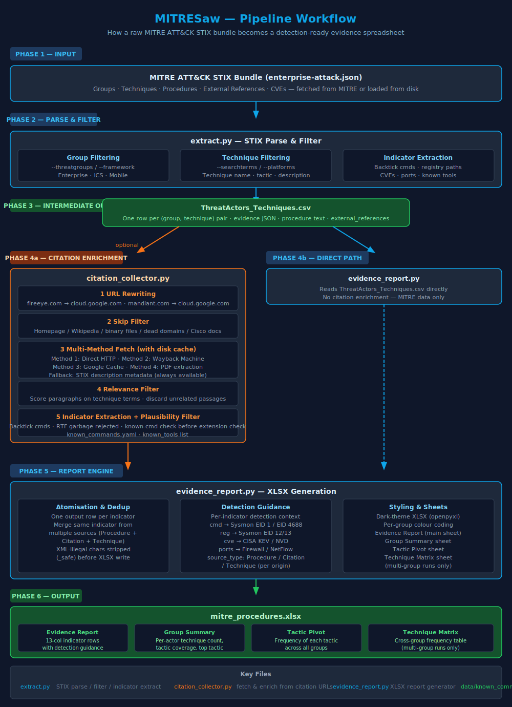

```
                                                                         ,
                                 ╓╗╗,                          ,╓▄▄▄Φ▓▓██▌╫D
                                ║▌ `▓L            ,,, ╓▄▄▄Φ▓▓▀▀▀╫╫╫╫╫╫╫▀▀╫▓▓▄
                                 ▓▄▓▓▓        ,▄▄B░▀╫Ñ╬░░╫╫▓▓▓▓╫╫╫╫▓▓▓╫╫╫╫╣▓▓▓▄
                                 ║████L   ,╓#▀▀▀╨╫ÑÑ╦▄▒▀╣▓▄▄▀╣▌╫▀    ██╫╫╫╫▓▓╫▓▓φ
                                  ▓╫╫╫▀]Ñ░░░░ÑÑÑÑ░░░░░╠▀W▄╠▀▓▒░╫Ñ╖   ╙└"╜▀▓▓▓▓▓█▓▓
                                  ║░░░╦╬╫╫╫╫╫╫╫╫╫╫╫╫╫ÑÑ░░░╠Ñ░╨╫Ñ░╫╫╫╫N     ▀▓▓▓╫██▓╕
                                ,]░╦╬╫╫╫╫╫╫╫▓▓▓▓▓▓╫╫╫╫╫╫╫Ñ░░╠░░╫M░╠╫╫╫╫╦,    ▀▓▓▓▓▓▓⌐
                       ╗▄╦     ]░░╬╫╫╫╫╫▓▓██████████▓▓▒╫╫╫╫Ñ░░╟▒╟▓▒ñ▓▓▓▓░N    ╙▓▓▓▓▓▓
                   ║███╫█╫    ]░░╫╫╫╫╫▓███▓▓▓▓▓▓▓▓▓▓███▓╫╫╫╫╫░░╟▒╟▓Ü╟▓▓▓▓░H    ╟▓▓▓▓▓L
                   ║███╫█╫   ]░░╫╫╫╫▓██▓╫▓▓▓▀▀╠╠╬▀▓▓▓╫▓██▓╫╫╫╫░░ÑÑ╠▄░╠▓▓▓▄▄▄▄▄▓▓▓╫╫╫╫
                    ╓▄▄╫█╫╖╖╖╦░╫╫╫╫╫██▓▓▓▓▀░╬Ñ╣╬╫Ñ░╟▓▓▓▓██╫╫╫╫Ñ░╦]░░░║████▀▀╫╫╫▓╩╨╟╫
                    ╟▓▓╫█╫▀▀▀╩╬╩╫╫▓██▓▓▓▓▌░╫░╟▓▓K╫Ñ░▓▓▓▓╫██▓▒╩╩╩╩ ╙╩╨▀▓M╨╩╨╙╝╣N╦╗Φ╝
                       ╫█╫     ▀███▀╣▓▓▓▓▓░╫Ñ░╠▀░╫Ü░▓▓▓▓▓▀▀███╕      ▐▓▌╖
                   ▄▄▄▄▓█▄▄▄▄▄▄▄▄▄▄▄▄▄▄▄▄▄▄▄▄▄▄▄▄▄▄▄▄▄▄▄▄▄▄▄▄▄▄▄▄▄▄▄▄▄▄▄▄▄╛
                                ▀╩╫╫╫╠╣▓▓▓▓▓▓▓▓▓▓▓▓▓▓▓▓▀░╫╫╫╫▌
                                 ╗▄╫╫Ñ░╠▀▓▓▓▓▓▓▓▓▓▓▓▓▀░╦╬╫╫∩
                                   `⌠╫╫╫Ñ░░Å╣▀▀▀▀▀▒░╦╬╫╫╫`█
                                    ╙╙""╫╫╫½╫╫╫╬╫╫╫╫╫M"▓╛
                                       └╙└ ▄▓╩`║▓╩ Å▀
```
<p align="center">
  <h1 align="center">MITRESaw</h1>
  <p align="center">
    Cut through MITRE ATT&amp;CK framework and extract relevant identifiers for searching and hunting.
    <br><br>
    <a href="https://mit-license.org"></a>
    <a href="https://github.com/cyberg3cko/MITRESaw/issues"></a>
    <a href="https://github.com/cyberg3cko/MITRESaw/network/members"></a>
    <a href="https://github.com/cyberg3cko/MITRESaw/stargazers"></a>
    <a href="https://www.python.org"></a>
    <a></a>
    <a href="https://github.com/psf/black"></a>
    <br><br>
  </p>
</p>

## Table of Contents

* [About the Project](#about-the-project)
* [Installation](#installation)
* [Usage](#usage)
* [Contributing](#contributing)
* [License](#license)
* [Contact](#contact)
* [Acknowledgements](#acknowledgements)


<br><br><br>

## About The Project

At its core, MITRESaw creates a CSV-formatted version of the [MITRE ATT&amp;CK Framework](https://attack.mitre.org) and outputs individual Threat Actor [ATT&amp;CK Navigator](https://mitre-attack.github.io/attack-navigator/) JSON files, depending on keywords provided.<br>
MITRESaw has evolved to also produce search queries based on extracted indicators (aligned with Threat Group TTPs). Searches currently provided are compatible with Splunk, Azure Sentinel and Elastic/Kibana. SIGMA will be included soon.

## Pipeline Workflow



The diagram above shows how a raw MITRE ATT&amp;CK STIX bundle flows through MITRESaw into a detection-ready XLSX report:

1. **Parse &amp; Filter** (`extract.py`) — loads the STIX bundle, applies group/platform/term filters, and extracts indicators from procedure text.
2. **Intermediate CSV** — `ThreatActors_Techniques.csv` holds one row per (group, technique) pair with evidence JSON.
3. **Citation Enrichment** (`citation_collector.py`, optional `-C`) — fetches each citation URL, filters to relevant passages, and extracts additional indicators.
4. **Report Engine** (`evidence_report.py`) — atomises indicators to one row each, deduplicates across sources, attaches detection guidance, and writes the styled XLSX.

<br><br><br>

## Installation

`python3 -m pip install -r requirements.txt`
<br><br><br>

## Usage
`./MITRESaw.py [options]`

All arguments are optional named flags with sensible defaults. To display usage, simply run: `./MITRESaw.py -h`
```
usage: MITRESaw.py [-h] [-f FRAMEWORK] [-p PLATFORMS] [-s STRINGS]
                   [-g THREATGROUPS] [-a] [-n] [-o] [-Q] [-q] [-t]
                   [-c COLUMNS] [-D] [-x {csv,json,xml}] [-E] [-C]
                   [-w MAX_WORKERS] [-A] [-I [DIR]]
                   [-rS] [-rN] [--clear-cache] [-F]

options:
  -h, --help                  show this help message and exit
  -f, --framework FRAMEWORK   Specify which framework - Enterprise, ICS or Mobile (default: all three)
  -p, --platforms PLATFORMS   Filter by platform e.g. Windows,Linux,IaaS (default: . for all)
  -s, --strings TERMS         Filter by industry e.g. mining,technology,defense (default: . for all)
  -g, --threatgroups GROUPS   Filter by group e.g. APT29,HAFNIUM,Turla (default: . for all)
  -a, --asciiart              Show ASCII Art of the saw
  -n, --navlayers             Obtain ATT&CK Navigator layers for identified Groups
  -o, --showotherlogsources   Show log sources with less than 1% coverage
  -Q, --queries               Build search queries for Splunk, Azure Sentinel, Elastic/Kibana
  -q, --quiet                 Suppress per-identifier output; print only group completion
  -t, --truncate              Truncate indicator output (still written to file)
  -c, --columns COLUMNS       Export filtered CSV with specified columns (comma-separated)
  -D, --default               Export key procedure columns to mitre_procedures.csv
  -I, --import-citations      Import manually saved PDF/HTML citations (default: data/citations/)
  -x, --export {csv,json,xml} Export format for output files (default: csv)
  -E, --evidence-report       Generate styled XLSX evidence report (one row per indicator)
  -C, --citations             Collect citation sources with multi-method fallback (requires -E)
  -w, --max-workers N         Max parallel threads for fetching (1-50, default: 50)
  -A, --auto                  Skip the pre-run ETA confirmation prompt
  -rS, --retry-stix           Retry citations that fell back to STIX metadata
  -rN, --retry-nocontent      Retry citations that had no content at all
  --clear-cache               Clear the entire citation cache before running
  -F, --fetch                 Force fresh download of ATT&CK STIX data
```

### Quick Start — If In Doubt

The `-D` (default) flag is the catch-all option. It extracts all groups across all platforms with the key procedure columns and produces a clean CSV ready for SIEM ingestion. Combine with `-E` to also get the styled XLSX evidence report:

```bash
./MITRESaw.py -D -E -C
```

This gives you everything you need to get started: `mitre_procedures.csv` for lookups, `mitre_procedures.xlsx` for analysis, and citation source content from blog posts, vendor reports, and PDFs. Add `-q` for quieter output, or layer on `-g`, `-p`, `-t` filters to narrow scope.

### Examples

```bash
# Default export with all groups (fastest way to get results)
./MITRESaw.py -D

# Quiet mode - show group completion instead of every indicator
./MITRESaw.py -D -q

# Filter by platform and threat group
./MITRESaw.py -p Windows -g APT29

# Export as JSON
./MITRESaw.py -g APT29 -x json

# Build search queries for specific groups on Windows/Linux
./MITRESaw.py -p Windows,Linux -t mining,technology,defense -Q

# Export filtered columns with industry keyword tagging
./MITRESaw.py -c group_sw_name,technique_id,technique_name,keywords

# Evidence report with SIEM queries
./MITRESaw.py -g APT29,APT33,OilRig -p Windows -E -Q

# Evidence report with citation collection
./MITRESaw.py -g APT29 -p Windows -E -C

# Retry only stix_metadata failures (keeps successful cache)
./MITRESaw.py -rS -D -E -C

# Retry only no-content failures
./MITRESaw.py -rN -D -E -C

# Retry both stix_metadata and no-content failures
./MITRESaw.py -rS -rN -D -E -C

# Nuclear option: clear entire cache and re-fetch everything
./MITRESaw.py --clear-cache -D -E -C

# Force refresh STIX data and clear citation cache
./MITRESaw.py -D -E -C --clear-cache -F
```

Valid column names for `--columns`:
```
group_sw_id, group_sw_name, group_sw_description, technique_id,
technique_name, technique_description, tactic, platforms, framework,
procedure_example, evidence, detectable_via, keywords
```

## Output Files

When `-E` is used, MITRESaw produces:

```
Outputs written to: data/2026-03-28/Windows__APT29/
  🏛️ mitre_procedures.csv
  📎 mitre_procedures.xlsx
  🍠 citations_failed.yaml
```

When no group/platform/term filters are provided, files are placed in the date root directory (e.g. `data/2026-03-28/`).

**`mitre_procedures.csv`** — One row per group+technique pair. Suitable for direct ingestion as a lookup table into Splunk (`| inputlookup`), Microsoft Defender for Endpoint, Elastic, or any SIEM. Fields are properly quoted per RFC 4180. Columns: `group_sw_id`, `group_sw_name`, `group_sw_description`, `technique_id`, `technique_name`, `technique_description`, `tactic`, `platforms`, `framework`, `procedure_example`, `evidence`, `detectable_via`.

**`mitre_procedures.xlsx`** — Styled evidence report with multiple sheets:

| Sheet | Description |
|-------|-------------|
| Evidence Report | One row per atomic indicator with 13 columns (see schema below) |
| Group Summary | Per-group stats: technique count, indicator count, tactic coverage, top tactic |
| Tactic Pivot | Indicators per tactic, sorted by count, with example technique IDs |
| Technique Matrix | Intersection matrix (only when 2+ groups): techniques as rows, groups as columns, `1` where a group uses that technique, sorted by group coverage descending for prioritising hunting |
| Reference Detail | Citation sources with extracted content, collection method, and URL (only with `-C`) |

**`citations_failed.yaml`** — List of citations that fell back to STIX metadata (URL fetch failed across all methods). Includes the full attempt chain for diagnostics. Only generated with `-C`.

## Evidence Report (-E)

The `--evidence-report` / `-E` flag generates a styled XLSX evidence report (`mitre_procedures.xlsx`) with **one row per atomic indicator** extracted from MITRE ATT&CK procedure examples, plus a companion `mitre_procedures.csv` for SIEM ingestion.

### 13-Column Schema

| # | Column | Description |
|---|--------|-------------|
| 1 | Evidential Element | The atomic indicator (command, registry key, CVE, port, path, software, event ID) |
| 2 | Threat Group | Canonical group name |
| 3 | Technique ID | ATT&CK technique ID (e.g. T1059.001) |
| 4 | Technique Name | ATT&CK technique name |
| 5 | Tactic | ATT&CK tactic |
| 6 | Platforms | Target platforms (e.g. Windows, Linux, macOS) |
| 7 | Framework | ATT&CK framework (Enterprise, ICS, Mobile) |
| 8 | Source Type | Where the indicator was sourced: `Procedure`, `Citation`, `Technique`, or `MITRE ATT&CK` (when evidence was absent) |
| 9 | Procedure Example | MITRE ATT&CK procedure text (cleaned: markdown links shown as `Name (ID)`, citations removed) |
| 10 | Detection Guidance | Detection context per indicator type (Sysmon EIDs, detection methods) |
| 11 | Log Sources | MITRESaw-mapped log sources (e.g. `Sysmon: 1`, `Security EventLog: 4688`, `AppLocker EventLog`, `netflow`, `PCAP`, `*nix /var/log`) |
| 12 | Reference URL | URL from procedure text or constructed ATT&CK technique URL |
| 13 | Navigation Layer URL | ATT&CK Navigator JSON layer URL for the group |

### Technique Matrix

When 2+ groups are provided (e.g. `-g APT29,APT33,OilRig`), a **Technique Matrix** sheet is added showing which techniques are shared across groups. Techniques are sorted by the number of groups that use them (descending), helping prioritise which TTPs to hunt for first — techniques used by all targeted groups offer the highest detection ROI.

## Citation Collection (-C)

The `-C` / `--citations` flag collects ALL citation source material for each technique — blog posts, vendor reports, government advisories, PDFs, and more. Citations are collected inline during extraction and displayed per technique, with indicators extracted from the fetched content.

### Multi-Method Fallback Chain

For each `(Citation: X)` found in procedure text, technique descriptions, and detection guidance, the collector tries multiple methods in order until content is obtained:

| Method | Description | Status Icon |
|--------|-------------|-------------|
| **direct** | Standard HTTP fetch with browser-like headers | ✅ |
| **headless** | Playwright Chromium for Cloudflare/JS-protected sites | ✅ |
| **wayback** | Wayback Machine (web.archive.org) archived snapshot | ✅ |
| **google_cache** | Google's cached version of the page | ✅ |
| **pdf:PyPDF2 / pdf:pdfplumber** | PDF downloaded and text extracted via parser | ✅ |
| **pdf:ocr** | Scanned/image-only PDFs rendered and OCR'd via `pdf2image` + `pytesseract` | ✅ |
| **cached** | Previously fetched, loaded from `.citation_cache/` | ✅ |
| **stix_metadata** | STIX description field only (author, title, date) | ⚠️ |

The OCR method is a fallback used only when a PDF yields no extractable text via the standard parsers (i.e. it is a scanned document or image-based PDF). It requires `pdf2image` (wraps poppler) and `pytesseract` (wraps Tesseract) to be installed. If absent, the collector falls back to `stix_metadata` as normal.

### URL Rewriting

Known migrated URLs are automatically rewritten:
- `www.mandiant.com/resources/...` → `cloud.google.com/blog/topics/threat-intelligence/...`
- `www.fireeye.com/blog/...` → `cloud.google.com/blog/topics/threat-intelligence/...`

### Filtered Citations

Homepages and documentation sites are automatically skipped (7-zip, WinRAR, Wikipedia, Microsoft docs, Cisco product docs, etc.) — these have no threat intelligence value.

### Indicator Extraction from Citations

When a citation page is successfully fetched, MITRESaw runs its extraction patterns against the content to find additional indicators not present in the MITRE procedure text. The same patterns used for native extraction are applied:

| Emoji | Type | What's extracted |
|-------|------|-----------------|
| 💻 | `cmd` | Commands, CLI invocations, backtick-quoted strings |
| 🔑 | `reg` | Windows registry paths |
| 🔒 | `cve` | CVE identifiers |
| 📁 | `paths` | Windows and Unix file/directory paths |
| 📦 | `software` | Executables, DLLs, tools |
| 🌐 | `ports` | Network port numbers |

**Only new indicators are shown** — anything already extracted by MITRESaw's native pipeline is deduplicated. This means techniques that had no native indicators (e.g. T1621 MFA Request Generation) can still gain indicators from their citation sources.

#### Known Commands (`data/known_commands.yaml`)

A comprehensive per-platform allowlist covers single-word commands that would otherwise be missed by the multi-word/flag heuristic. For example, `hwclock`, `timedatectl`, `date`, `net`, `sc`, `w32tm` — all common in threat reports but trivially short. The YAML is organised by platform (`windows`, `linux`, `macos`, `cross_platform`) and type (`cmd`, `software`) and can be extended without touching code.

Approximately 300 single-word commands and 80 known offensive tool names (mimikatz, rubeus, bloodhound, cobalt strike, etc.) are included by default.

**Classification priority** — when a backtick-quoted string is encountered, the classifier checks in this order:

1. Registry path (`HKLM\...`, `HKCU\...`) → `reg`
2. File/directory path (`C:\...`, `\\unc\...`, `/etc/...`) → `paths`
3. **First word is a known command** (from YAML) → `cmd` — this takes priority over any file extension in the arguments, so `powershell -File x.ps1`, `schtasks /tr x.exe`, and `del /f /q x.exe` are correctly classified as `cmd` rather than `software`
4. Contains a known file extension (`.exe`, `.dll`, `.ps1`, etc.) → `software`
5. Known offensive tool name (from YAML, no extension) → `software`
6. Multi-word or contains flags/path separators → `cmd`
7. Single-word match in YAML `cmd` list → `cmd`

Windows shell built-ins covered include: `cmd`, `powershell`, `pwsh`, `schtasks`, `sc`, `reg`, `net`, `del`, `copy`, `move`, `ren`, `rmdir`, `type`, `attrib`, `icacls`, `xcopy`, `robocopy`, and ~280 others across Windows, Linux, macOS, and cross-platform.

#### Relevance Filtering

Before extracting indicators, fetched citation text is filtered to the most relevant paragraphs. Scoring is **technique-focused** — paragraphs are ranked by the number of technique-related terms they contain (technique name, technique ID, sub-technique parent ID, and up to five extracted indicators used as supplementary signals). Group name is deliberately excluded from scoring: MITRE has already done the actor→citation linkage, and searching for the group name is redundant regardless of whether the citation is actor-specific or describes generic tool behaviour.

Citation-extracted indicators are:
- **Displayed in the terminal** under each citation with emojis
- **Injected as native evidence rows** into `mitre_procedures.csv` and `mitre_procedures.xlsx`
- **Atomised** in the evidence report (one row per indicator, same as native indicators)
- **Included in the Technique Matrix** — techniques gain group coverage from citation indicators

The procedure example column for these rows shows `"Indicators extracted from citation: <name> (<url>)"` to distinguish them from MITRE-sourced indicators.

### Manual Import (`-I`)

For sites that block automated access, save the page as PDF or HTML from your browser and import it:

```bash
# Save blocked pages into data/citations/
# e.g. securelist.com_apt-report.pdf, unit42_medusa.html

# Import and run
./MITRESaw.py -I -D -E -C

# Or specify a different directory
./MITRESaw.py -I /path/to/saved/pages -D -E -C
```

Supported formats: `.pdf`, `.html`/`.htm`, `.txt`. Imported files are cached and used on all future runs.

### Status Icons

| Icon | Meaning |
|------|---------|
| ✅ | Content freshly fetched from source |
| 💾 | Content loaded from local cache |
| ⚠️ | STIX metadata only (author/title/date — fetch failed) |
| ❌ | No content at all |

### Cache

Fetched pages are cached locally to avoid re-downloading on subsequent runs. Failed URLs are also cached within the same run to avoid re-trying the same broken URL across multiple procedures — this is the single biggest performance optimisation (see below).

### Retry Options

| Flag | What it removes | When to use |
|------|----------------|-------------|
| `-rS` / `--retry-stix` | Cache entries where fetch failed, only STIX metadata captured (⚠️) | After fixing SSL/network issues — sites that were unreachable may now work |
| `-rN` / `--retry-nocontent` | Cache entries with completely empty text (❌) | After installing Playwright — previously unfetchable pages may now parse |
| `--clear-cache` | Everything | Start completely fresh — re-fetches all ~5,000+ URLs |

Use `-rS` and `-rN` together to retry all failures while keeping successful cache:
```bash
./MITRESaw.py -rS -rN -D -E -C
```

### Pre-Run ETA Estimate

When using `-C`, MITRESaw scans the cache before starting and shows a summary:

```
    ┌─────────────────────────────────────────────
    │  Procedures:         4750
    │  Citations:         17451
    │  Cached:            4562
    │  Uncached:          1306
    │  Workers:              50
    │  Estimated time:   1m 18s
    └─────────────────────────────────────────────

    Continue? [Y/n]
```

Use `-A` / `--auto` to skip the confirmation and start immediately.

### Pre-Fetch Phase

Before processing procedures, all uncached citations are fetched in a single parallel batch using all available workers. This maximises parallelism — instead of fetching 1-3 citations per procedure sequentially, all uncached URLs are fetched at once. A live progress counter shows completion and ETA.

After pre-fetching, the main processing loop reads exclusively from cache and runs in seconds.

### Estimated Run Times

Times are approximate for a full all-groups run (~4,750 procedures, ~17,000 citations, 50 workers). Subsequent runs with a warm cache are significantly faster.

| Command | First Run | Cached Run | What It Does |
|---------|-----------|------------|-------------|
| `-D` | ~2 min | ~2 min | Extract procedures to CSV |
| `-D -E` | ~3 min | ~3 min | + styled XLSX evidence report |
| `-D -E -C` | ~5-15 min | ~3 min | + citation collection (pre-fetch + extraction) |
| `-D -E -C -Q` | ~5-15 min | ~4 min | + search queries (Splunk/Sentinel/Elastic) |
| `-D -E -C -n` | ~8-18 min | ~6 min | + Navigator layer downloads |
| `-D -E -C -rS` | ~5-15 min | ~5-15 min | + retry STIX-metadata failures |

The citation pre-fetch phase accounts for most of the first-run time. The `-rS` flag clears cached failures and re-fetches them, so it always takes first-run time. A 30-day cooldown warning is shown if `-rS` was used recently, since the same URLs will likely fail again.

### Adaptive Worker Throttling

Workers start at the configured maximum (default 50) and automatically adjust during execution:
- **On 429 rate-limit**: workers halve (e.g. 50 → 25)
- **After 50 clean procedures**: workers increase by 2 (e.g. 25 → 27)
- Current worker count and rate-limit count are shown in the progress bar

### Performance

| Optimisation | Detail |
|-------------|--------|
| Request timeout | 8s (direct, wayback fetch, google cache) |
| Wayback Machine API timeout | 5s |
| Per-domain rate limit | 0.5s between requests to same domain |
| Global rate limit | Disabled — per-domain delay is sufficient |
| Cached failure recognition | Empty cache entries skip the full method chain instantly |
| Pre-fetch batch | All uncached URLs fetched in one parallel batch before processing |
| Gibberish filtering | Garbled PDF content (base64, binary) rejected before indicator extraction |

### Optional Dependencies

| Package | Purpose | Install |
|---------|---------|---------|
| `playwright` | Headless browser for JS/Cloudflare sites | `pip install playwright && playwright install chromium` |
| `pdf2image` | Render PDF pages to images for OCR | `pip install pdf2image` (also requires [poppler](https://poppler.freedesktop.org): `brew install poppler` / `apt install poppler-utils`) |
| `pytesseract` | OCR images from scanned PDFs | `pip install pytesseract` (also requires [Tesseract](https://github.com/tesseract-ocr/tesseract): `brew install tesseract` / `apt install tesseract-ocr`) |

All three are optional — the collector works without them and falls back gracefully. Install `pdf2image` + `pytesseract` (plus their system libraries) to enable OCR of scanned/image-only PDFs that yield no text via PyPDF2 or pdfplumber.

### Failed Citations Report

Citations that fell back to `stix_metadata` are written to `citations_failed.yaml` in the output directory, with the full attempt chain for each URL.

## Running in the Background

For large runs (all groups with citation collection), MITRESaw can take a significant amount of time. Use `tmux` to run it in the background and reconnect later:

```bash
# Start a tmux session
tmux new -s mitresaw

# Run MITRESaw
./MITRESaw.py -D -E -C

# Detach from tmux: press Ctrl+B then D

# Re-attach anytime to see live progress
tmux attach -t mitresaw
```

Alternatively, run with `nohup` and monitor the log:

```bash
# Run in background
nohup ./MITRESaw.py -D -E -C -q > mitresaw.log 2>&1 &

# Check progress
tail -5 mitresaw.log

# Watch live
tail -f mitresaw.log
```

### Progress Bar

A dual progress bar is pinned to the bottom of the terminal showing:
- **Procedures** — extraction progress across all group+technique pairs
- **Citations** — collection progress across all citation sources
- **ETA** — estimated time remaining

The progress bar stays in place while extraction output scrolls above it. The current worker count and rate-limit count are shown alongside the ETA.

## Exclusion List

MITRESaw supports an exclusion list to filter out known false-positive indicators. Edit `data/exclusions.csv` with two columns:

```csv
indicator,reason
whoami,Common benign command
ipconfig,Common benign command
```

Exclusions are case-insensitive and apply to both native and citation-extracted indicators. Excluded indicators are silently removed from terminal output and export files.

The exclusion list can also be managed via the web interface.

## Web Interface

MITRESaw includes a single-page web interface for running and monitoring from a browser:

```bash
pip install fastapi uvicorn sse-starlette
python mitresaw_web.py
# Open http://localhost:6729
```

Features:
- **Run configuration** — checkbox flags, group/platform filters, worker count
- **Live log streaming** — real-time output via Server-Sent Events
- **Cache statistics** — total cached, success/failed counts, disk usage
- **Output file browser** — download CSV/XLSX results directly
- **Exclusion editor** — add/remove exclusions from the browser
- **Stop button** — cancel a running extraction

No authentication is included — intended for local use only.

### Notices

Because the MITRE ATT&amp;CK has been built and is managed in the United States, the keywords provided need to be in US English, as opposed to UK English (e.g. defense vs defence).
<br><br><br>


## Testing

```bash
# Run all tests
.venv/bin/python -m pytest tests/ -v

# Run with full inspection output (recommended for reviewing what the pipeline extracts)
.venv/bin/python -m pytest tests/test_citation_workflow.py -v -s

# Run a specific section
.venv/bin/python -m pytest tests/test_citation_workflow.py -v -s -k "TestRelevanceExtraction"
```

The test suite covers:

| Section | File | What it tests |
|---------|------|---------------|
| A — Relevance Extraction | `test_citation_workflow.py` | Paragraph filtering: right text survives, noise is dropped |
| B — Indicator Extraction | `test_citation_workflow.py` | cmd/software/reg/path/CVE/port classification from realistic text |
| C — Full Pipeline | `test_citation_workflow.py` | End-to-end: relevance filter → extraction → dedup |
| D — ATT&CK Spot-checks | `test_citation_workflow.py` | Parametrized fixtures for 8 real technique IDs |
| E — Edge Cases | `test_citation_workflow.py` | Empty input, short text, garbled PDF, HTML stripping |
| F — Known Limitations (xfail) | `test_citation_workflow.py` | Documents known gaps; `XPASS` means a limitation has been fixed |
| Unit tests | `test_citation_collector.py` | Function-level tests for URL rewriting, skip logic, HTML parsing, imports |

Running with `-s` prints `WHAT / WHY / PASS` description lines before each test's output so the suite is self-documenting without reading the source.

**Section F (xfail)** tracks known limitations rather than bugs. An `xfail` result means the limitation is still present (expected). An `XPASS` result means it has been fixed — the marker should be removed and the test promoted to a normal pass.

Current known limitations:
- Commands in a prose paragraph that contains no technique name/ID score zero in the relevance filter and are dropped, even if the technique was established in an earlier paragraph. Fix: the paragraph must explicitly mention the technique name or ID alongside the command.
- Bare process names in backticks (e.g. `` `lsass` ``, `` `explorer` ``) with no `.exe` extension and not listed in `data/known_commands.yaml` are not captured. Fix: add the name to the YAML.

## Acknowledgements
* [Best-README-Template](https://github.com/othneildrew/Best-README-Template)
* [Img Shields](https://shields.io)
* [Choose an Open Source License](https://choosealicense.com)
* [GitHub Pages](https://pages.github.com)

<br><br><br>

<!-- MARKDOWN LINKS & IMAGES -->
<!-- https://www.markdownguide.org/basic-syntax/#reference-style-links -->
[contributors-shield]: https://img.shields.io/github/contributors/cyberg3cko/bruce.svg?style=flat-square
[contributors-url]: https://github.com/cyberg3cko/bruce/graphs/contributors
[forks-shield]: https://img.shields.io/github/forks/cyberg3cko/bruce.svg?style=flat-square
[forks-url]: https://github.com/cyberg3cko/bruce/network/members
[stars-shield]: https://img.shields.io/github/stars/cyberg3cko/bruce.svg?style=flat-square
[stars-url]: https://github.com/cyberg3cko/bruce/stargazers
[issues-shield]: https://img.shields.io/github/issues/cyberg3cko/bruce.svg?style=flat-square
[issues-url]: https://github.com/cyberg3cko/bruce/issues
[license-shield]: https://img.shields.io/github/license/cyberg3cko/bruce.svg?style=flat-square
[license-url]: https://github.com/cyberg3cko/bruce/master/LICENSE.txt
