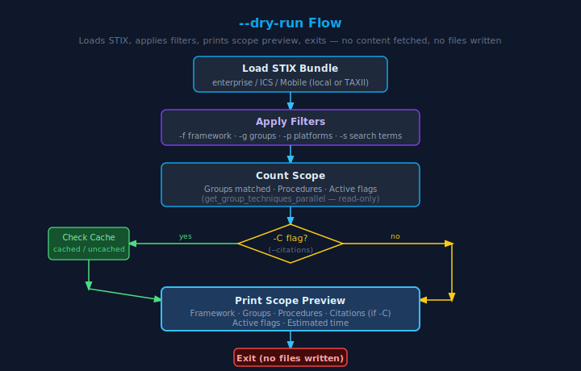
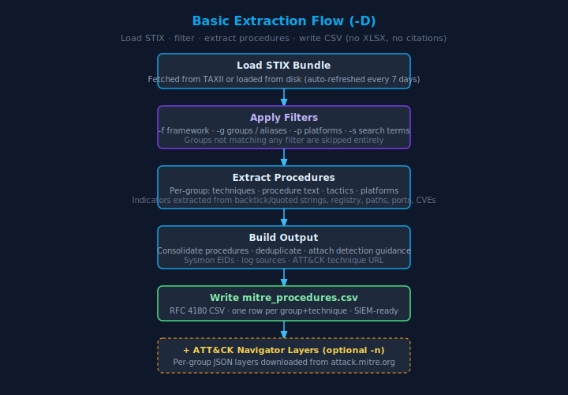
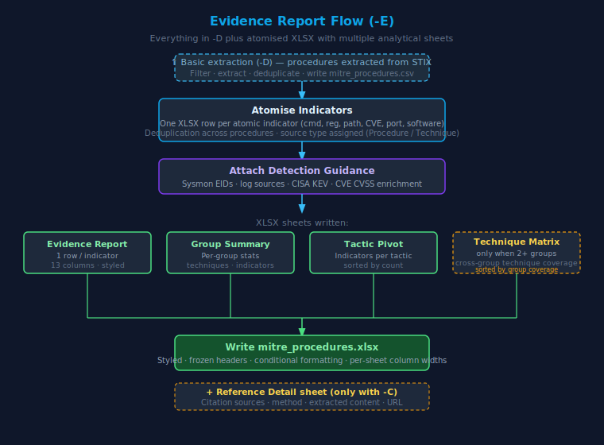
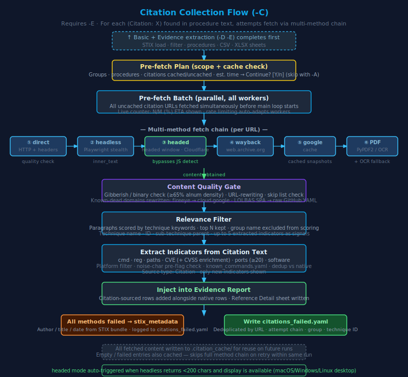

# MITRESaw — Per-Flag Flow Diagrams

Each diagram below shows the exact path taken through MITRESaw depending on which flags are invoked.  
All diagrams use the same dark theme as the main workflow diagram.

---

## `--dry-run`

Loads STIX data and applies all filters to count scope, then prints a summary and exits — **no content is fetched and no files are written**.



**Key behaviour:**
- With `-C`: also checks cache to show cached vs uncached citation counts and estimated time
- Without `-C`: shows groups matched, procedures, and active flags only
- Safe to run repeatedly — read-only operation

```bash
./MITRESaw.py --dry-run -f Enterprise -s Iran -E -C
./MITRESaw.py --dry-run -g APT29 -p Windows -E -C
```

---

## Basic Extraction  (`-D`)

Loads STIX, applies filters, extracts procedures and indicators from procedure text, writes `mitre_procedures.csv`.



**Key behaviour:**
- Indicators extracted from backtick/quoted strings in MITRE procedure text: `cmd`, `reg`, `paths`, `CVE`, `ports`, `software`
- Deduplication across group+technique pairs
- SIEM-ready RFC 4180 CSV output
- Add `-n` to also download ATT&CK Navigator JSON layers per group

```bash
./MITRESaw.py -D
./MITRESaw.py -D -g APT29 -p Windows
./MITRESaw.py -D -s Iran -f Enterprise -n
```

---

## Evidence Report  (`-E`)

Everything in `-D`, plus indicator atomisation, detection guidance enrichment, and a multi-sheet styled XLSX.



**Key behaviour:**
- One XLSX row per atomic indicator (not per technique)
- Source type assigned per row: `Procedure`, `Technique`, `Citation`, `MITRE ATT&CK` (placeholder when no indicators extracted)
- `Procedure | Citation` when the same indicator appears in both MITRE text and a citation source
- Technique Matrix sheet added automatically when 2+ groups are in scope
- Reference Detail sheet only added when `-C` is also present

```bash
./MITRESaw.py -D -E
./MITRESaw.py -D -E -g APT29,APT33,OilRig
```

---

## Citation Collection  (`-C`)

Requires `-E`. For every `(Citation: X)` reference in procedure text, fetches the source URL via a multi-method fallback chain and extracts additional indicators from the fetched content.



**Key behaviour:**
- Pre-fetch plan shown before starting — prompts for confirmation (skip with `-A`)
- All uncached URLs fetched in a single parallel batch before main processing loop
- Fallback chain: direct HTTP → headless Playwright → headed Playwright → Wayback Machine → Google Cache → PDF (+ OCR)
- `headed` mode auto-triggered when headless returns < 200 chars and a display is available (always on macOS/Windows; on Linux when `DISPLAY`/`WAYLAND_DISPLAY` is set)
- Content quality gate rejects binary/garbled responses (< 65% alnum density)
- Known-dead URL rewrites: `fireeye.com` → `cloud.google.com`, LOLBAS SPA → raw GitHub YAML
- Citation-extracted indicators enriched and injected as `Citation`-source rows in the Evidence Report
- Failed citations written to `citations_failed.yaml` (deduplicated by URL)

```bash
./MITRESaw.py -D -E -C
./MITRESaw.py -D -E -C -g APT29 -p Windows -A
```

---

## Retry / Cache Management  (`-rS`  `-rN`  `-rJ`  `--clear-cache`)

These flags manipulate the citation cache before the main extraction runs.


| Flag | Removes from cache | Use when |
|------|--------------------|----------|
| `-rS` / `--retry-stix` | Entries where `method == "stix_metadata"` | Sites that were unreachable may now be up |
| `-rN` / `--retry-nocontent` | Entries where `method == "no_content"` | After installing Playwright — previously unrenderable pages may now work |
| `-rJ [YAML]` / `--retry-js` | Reads failed URL list; re-fetches with headed browser | Cloudflare-blocked sites that headed mode can bypass |
| `--clear-cache` | **All** cache entries | Complete reset — re-fetches all ~5000+ URLs |

**Execution order within one call:** `--clear-cache` → `-rS` → `-rN` → `-rJ` → `-I` → main extraction

```bash
# Retry all failures, keep successes
./MITRESaw.py -rS -rN -D -E -C

# Retry JS-blocked sites from a specific run's failure list
./MITRESaw.py -rJ data/2026-04-15/citations_failed.yaml
./MITRESaw.py -D -E -C   # then run normally — cache is now warm

# Nuclear option
./MITRESaw.py --clear-cache -D -E -C
```

**`-rS` 30-day cooldown:** If `-rS` was used within the last 30 days, MITRESaw warns that the same URLs will likely fail again and offers to skip. The same external factors (paywalls, dead domains, Cloudflare) will block re-fetches. Use `--clear-cache` for a complete reset instead.

---

## Manual Import  (`-I`)

For sites that block all automated access, save the page manually as PDF or HTML from your browser, then import it:

```bash
# Save blocked pages into data/citations/
# e.g.  securelist.com_apt-report.pdf
#        unit42_medusa.html

./MITRESaw.py -I -D -E -C
./MITRESaw.py -I /path/to/saved/pages -D -E -C
```

Supported formats: `.pdf`, `.html`/`.htm`, `.txt`  
Imported files are written to cache and used automatically on all future runs.

---

## Listing Filter Values  (`-l`)

Does not run extraction — loads STIX data (groups only) and prints available filter values, then exits.

```bash
./MITRESaw.py -l groups     # all threat groups and aliases
./MITRESaw.py -l platforms  # valid -p values
./MITRESaw.py -l strings    # suggested -s keywords by category
```
